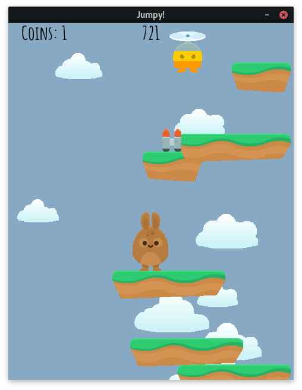
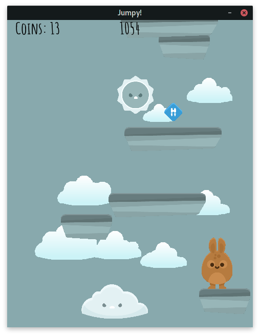
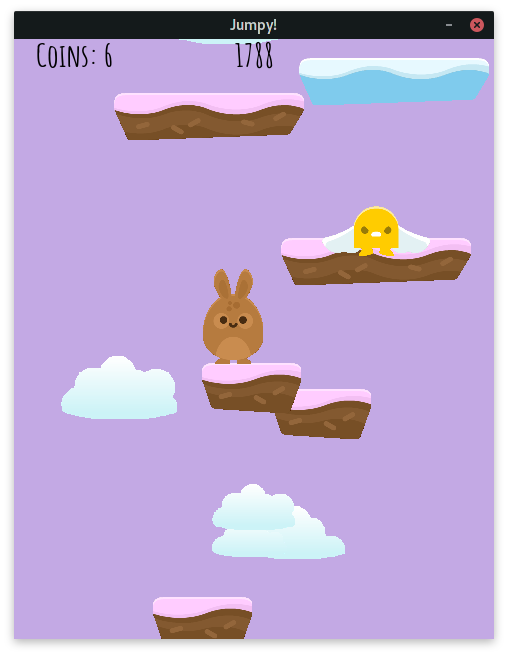
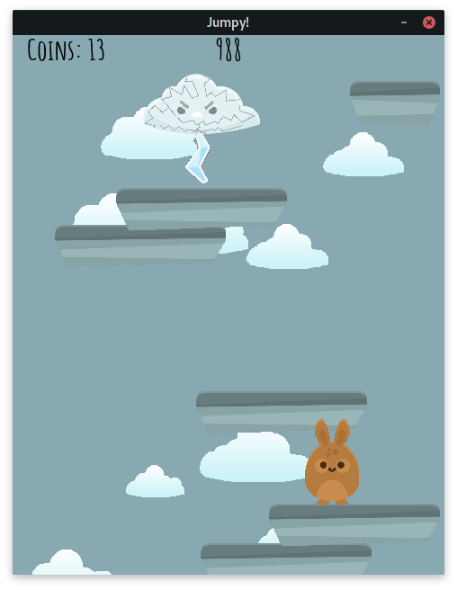

# **Jumpy! Remastered** 

Jumpy! is a game, tutorial for which you can find on the [KidsCanCode](https://www.youtube.com/channel/UCNaPQ5uLX5iIEHUCLmfAgKg) Youtube channel.
This here is here is **Jumpy! Remastered**, which is my upgraded version of it. Some info about this game is provided below.

## **List of all changes**

- Added **4** new mobs(_Cloud, Wingman, Spikey, Sun/Moon_)
- Added **4** new platform types(_Moving up/down, Sandy(More friction), Icy(Less friction)_)
- Added **4** Biomes with the changing _fadeout background_(Which I am really proud of by the way), each biome contains different platforms and mobs.
- Added **3** more powerups(_Bubble, Wings, Jetpack_)

## **Installation**

Clone the repository

```bash
git clone https://github.com/Adeon18/Jumpy.git
```

Use the package manager [pip](https://pip.pypa.io/en/stable/) to install the needed libraries.

```bash
pip install requirements.txt
```

## **Usage**

Just open it in some editor and run the **main** module after installing all the requirements above.

## **How the game looks**

Tbh it's quite an abomination

   

## Additional info

**This is not the project to take as an example!** I wrote this, when I was quite new to coding, so there is a lot of horrible code here :)

## Credits

- Art by [Kenney](https://www.kenney.nl/)
- Bg Music by [diiienow](https://www.youtube.com/channel/UC7ASBj4jBxsNawTiauUgwdQ)
- Game Base by [KidsCanCode](https://www.youtube.com/channel/UCNaPQ5uLX5iIEHUCLmfAgKg)
- And the final version by [me:D - Adeon18](https://www.youtube.com/channel/UCFbGvtju4J6QCqbM85zglhA)

## License

[MIT](https://choosealicense.com/licenses/mit/)